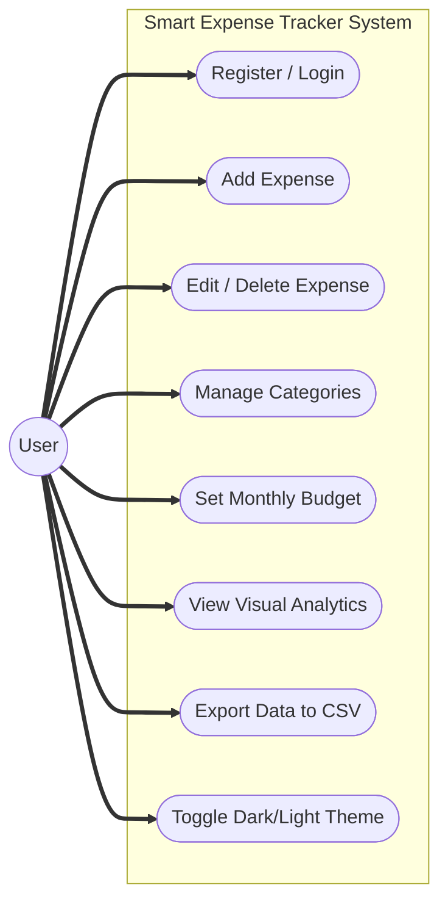
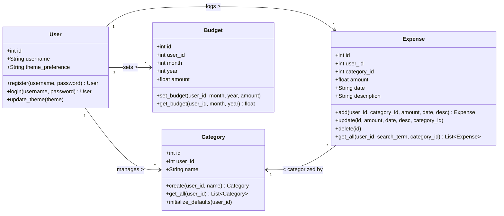
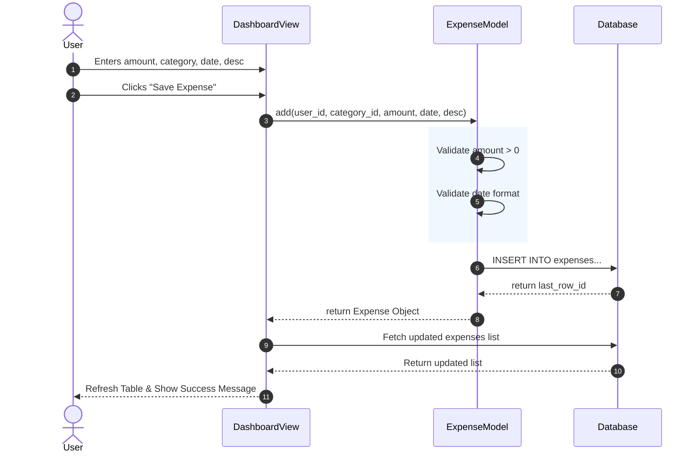
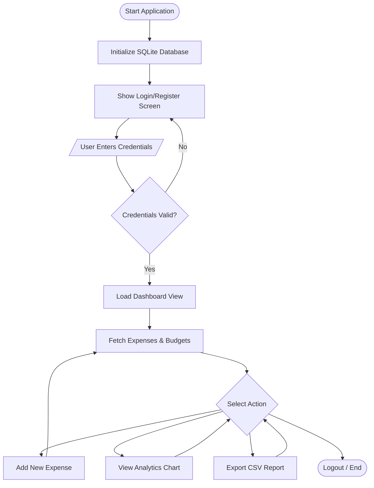

# Smart Expense Tracker - Comprehensive UML Diagrams

This document contains professional, high-resolution UML diagrams for the **Smart Expense Tracker** project. 
To ensure perfectly centered connections (exactly attaching to the middle-left, middle-right, top-center, and bottom-center), these diagrams strictly utilize directional layouts (Left-to-Right `LR` and Top-to-Bottom `TB`) which automatically enforce clean, non-overlapping routing.

---

## 1. Use Case Diagram
**Purpose:** Maps out the interactions between the User (Actor) and the core features of the system.
**Layout:** Left-to-Right (`LR`) ensures arrows exit the right side of the actor and enter exactly the middle-left side of each use case oval.

---

## 2. Class Diagram
**Purpose:** Defines the Object-Oriented structure, including class properties, methods, and relationships.
**Layout:** Left-to-Right (`LR`) to cleanly align associations and inheritance arrows without overcrowding.

---

## 3. Sequence Diagram (Adding an Expense)
**Purpose:** Details the step-by-step chronological sequence of operations when a user adds a new expense.
**Layout:** Time flows from top to bottom. Horizontal messages perfectly align to the exact center of each participant's vertical lifeline.

---

## 4. Activity Diagram (System Login & Dashboard Flow)
**Purpose:** Illustrates the workflow and decision paths within the application.
**Layout:** Top-to-Bottom (`TB`) guarantees that control arrows attach exactly to the top and bottom center points of each state box and decision diamond.

